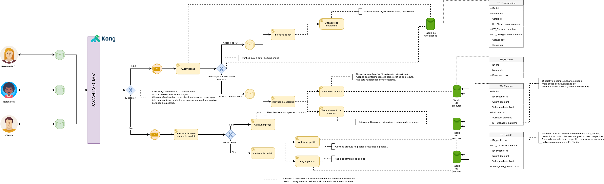

# mercadinho-voinha [WIP]
Sistema de supermercado desenvolvido utilizando arquitetura de microsserviços, para a disciplina de Arquitetura de Sistemas Orientado a Serviços ministrada no semestre 2020.2 na UFRPE.

## Arquitetura proposta

### Modelagem
Para entender mais sobre a arquitetura proposta, veja a figura a baixo.

### Tecnologias

* O API Gateway será desenvolvido utilizando o [Kong](https://konghq.com/);
* Os microsserviços serão desenvolvidos utilizando REST, com o [FastAPI](https://fastapi.tiangolo.com/);
* A linguagem principal de desenvolvimento será o Python;
* Para versionamento dos pacotes Python, será utilizado o [Poetry](https://python-poetry.org/);
* Documentação será disponibilizada via [Swagger](https://swagger.io/);
* A comunicação com banco de dados relacional será via [SQLAlchemy](https://www.sqlalchemy.org/);
* Irá ser utilizado como banco de dados o [SQLite](https://sqlite.org/index.html).

## Instalação

TODO

## Execução

TODO
